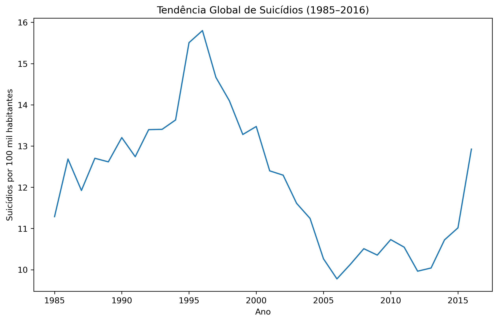
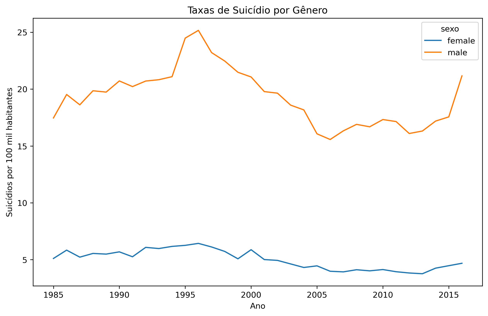

# 📊 Análise Global das Taxas de Suicídio (1985–2016)

## 📌 Descrição do Projeto

- Este projeto apresenta uma análise exploratória de dados (EDA) sobre taxas de suicídio em diversos países ao longo do período de 1985 a 2016, utilizando uma base pública disponibilizada no Kaggle.

- O objetivo é identificar padrões temporais, diferenças demográficas e possíveis relações com fatores socioeconômicos, contribuindo para uma melhor compreensão de um problema relevante de saúde pública global.

## 🎯 Objetivos da Análise

- Analisar a evolução global das taxas de suicídio ao longo do tempo

- Comparar taxas de suicídio por gênero

- Avaliar diferenças entre faixas etárias

- Investigar a relação entre PIB per capita e taxas de suicídio

## 🗂️ Base de Dados

- **Fonte**: Kaggle

- **Período**: 1985 a 2016

- **Granularidade**: País, ano, gênero e faixa etária

**Principais variáveis:**

  - `pais` — País de ocorrência

  - `ano` — Ano da observação

  - `sexo` — Masculino / Feminino

  - `faixa_etaria` — Faixa etária da população

  - `numero_suicidios` — Número absoluto de suicídios

  - `populacao` — População do grupo

  - `suicidios_por_100k` — Taxa de suicídio por 100 mil habitantes

  - `pib_per_capita_usd` — PIB per capita (USD)

  - `geracao` — Geração demográfica

## 🧹 Tratamento e Preparação dos Dados

- Padronização dos nomes das colunas para português

- Conversão de variáveis numéricas

- Remoção de registros com valores ausentes na taxa de suicídio

- Organização dos dados para análise temporal e comparativa

## 📈 Principais Análises Realizadas
🔹 Tendência Global

  - Análise da média global das taxas de suicídio ao longo do tempo, identificando períodos de crescimento, estabilização e queda.

🔹 Diferença por Gênero

  - Comparação das taxas de suicídio entre homens e mulheres ao longo dos anos, evidenciando padrões estruturais consistentes.

🔹 Faixa Etária

  - Avaliação da taxa média de suicídio por faixa etária, identificando grupos mais vulneráveis.

🔹 Relação com PIB per capita

  - Análise exploratória da relação entre desenvolvimento econômico e taxas de suicídio, mostrando que fatores econômicos isolados não explicam o fenômeno.

## 📊 Exemplo de Resultados

Ao longo da análise, foram exploradas tendências temporais e diferenças entre grupos populacionais.
O gráfico abaixo ilustra a tendência global da taxa média de suicídios por 100 mil habitantes entre 1985 e 2016:

### Tendência Global das Taxas de Suicídio (1985–2016)

📌 Observa-se um crescimento gradual das taxas até o início dos anos 2000, seguido por períodos de estabilização e queda, possivelmente associados a políticas públicas, mudanças sociais e avanços na área da saúde mental.

### Suicídio por Genêro

📌 Homens apresentam taxas consistentemente mais elevadas de suicídio em comparação às mulheres ao longo de todo o período analisado.

## 🧠 Principais Insights

- Homens apresentam taxas de suicídio significativamente mais altas em comparação às mulheres

- Faixas etárias mais avançadas possuem maior vulnerabilidade

- Não há relação linear forte entre PIB per capita e taxas de suicídio

- O suicídio é um fenômeno multifatorial, influenciado por fatores sociais, econômicos e demográficos

## 🛠️ Tecnologias Utilizadas

- Python

- Pandas

- Matplotlib

- Seaborn

## 📌 Conclusão

Este projeto demonstra como a análise de dados pode contribuir para a compreensão de problemas complexos de saúde pública, auxiliando pesquisadores, analistas e formuladores de políticas na tomada de decisões baseadas em evidências.

## 📎 Fonte dos Dados

Kaggle – Suicide Rates Dataset (1985–2016)
